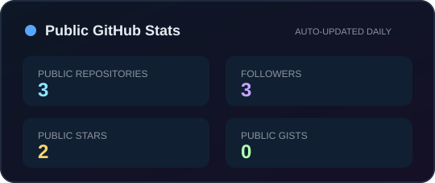

<p align="center">
  
</p>

<p align="center">
  <a href="https://zx2002430.github.io/Personal-Homepage/"></a>
  <a href="https://orcid.org/0009-0002-6842-4689"></a>
  <a href="mailto:2531711658@qq.com"></a>
</p>

<p align="center">
  
  
  
  
</p>

## 👋 Hi, I'm Xun Zhao



I am an **AI and robotics researcher** interested in making learned policies work beyond a simulation demo.

- 🤖 Building coordinated robot systems for dynamic, shared workspaces
- 🧠 Exploring embodied intelligence, VLA, meta-learning, and multi-agent RL
- 🔭 Turning MuJoCo experiments into ROS 2-enabled real-robot deployments
- 📍 Working from China · always open to thoughtful research conversations

<br clear="right" />

## 🧩 Research map

| Perception | Learning | Deployment |
| :-- | :-- | :-- |
| RGB-D · YOLO · Calibration | PPO · Meta-RL · MARL · VLA | UR5 · ROS 2 · MoveIt · MuJoCo |

```text
perceive the world  →  learn to adapt  →  act safely in the world
```

## 🛠️ Tools I enjoy using

<p align="center">
  
</p>

<p align="center">
  
  
</p>

## 🚀 Featured work

<table>
  <tr>
    <td width="50%" valign="top">
      <h3>Dual-Arm UR5 · DM-NAV</h3>
      <p>Coordinated dual-arm navigation with dynamic obstacle avoidance, RGB-D perception, and sim-to-real deployment.</p>
      <a href="https://zx2002430.github.io/Personal-Homepage/dual-ur5.html"></a>
    </td>
    <td width="50%" valign="top">
      <h3>Unitree Z1 · Visual Manipulation</h3>
      <p>A MuJoCo-based hierarchical SAC baseline for pick-and-place with wrist RGB-D perception.</p>
      <a href="https://github.com/zx2002430/Unitree_z1_reserach"></a>
    </td>
  </tr>
</table>

## 📫 Let’s connect

<p align="center">
  <a href="https://zx2002430.github.io/Personal-Homepage/">Portfolio</a>
  &nbsp;·&nbsp;
  <a href="https://orcid.org/0009-0002-6842-4689">ORCID</a>
  &nbsp;·&nbsp;
  <a href="mailto:2531711658@qq.com">Email</a>
</p>

<p align="center">
  <sub>Fusing perception, learning, and control for robots in the real world.</sub>
</p>
