<p align="center">
  
</p>

<p align="center">
  <a href="https://zx2002430.github.io/Personal-Homepage/"></a>
  <a href="mailto:2531711658@qq.com"></a>
</p>

<p align="center">
  
  
  
  
  
</p>

## Hi, I'm Xun Zhao 👋

I build **robot learning systems that can leave simulation**. My work sits at the intersection of embodied intelligence, multi-agent reinforcement learning, robot perception, and real-world control.

目前专注于让机器人在复杂、动态的共享空间中做到：**看得见、学得快、动得稳**。

| 🔭 Building | 🧠 Exploring | ⚙️ Shipping |
| :-- | :-- | :-- |
| Dual-arm robot coordination | VLA & embodied intelligence | ROS 2 + MuJoCo sim-to-real stacks |

## Selected work

### 🤖 Dual-Arm UR5 · Dynamic Navigation

**DM-NAV** is a dual-arm research platform for coordinated motion and dynamic-obstacle avoidance. It connects task generation, multi-agent policy learning, RGB-D perception, and real-robot control in one sim-to-real loop.

- **Learning:** meta multi-agent reinforcement learning for rapid task adaptation
- **Perception:** RGB-D sensing, object localization, and calibration-aware state estimation
- **Deployment:** MuJoCo → ROS 2 / MoveIt → dual UR5 hardware

<p>
  <a href="https://zx2002430.github.io/Personal-Homepage/dual-ur5.html"></a>
  <a href="https://zx2002430.github.io/Personal-Homepage/"></a>
</p>

## Technical radar

```text
Perception      RGB-D · YOLO · Calibration · State Estimation
Learning        PPO · Multi-Agent RL · Meta-Learning · VLA
Robotics        UR5 · ROS 2 · MoveIt · ros2_control
Simulation      MuJoCo · Gymnasium · Digital Twins
Engineering     Python · PyTorch · C++ · Linux
```

## What I care about

```text
simulated success ──► reliable behavior ──► useful physical systems
```

I enjoy research problems where an elegant learning method must earn its place on a real machine: noisy sensors, safety boundaries, imperfect calibration, and all.

## Connect

- Portfolio: [zx2002430.github.io/Personal-Homepage](https://zx2002430.github.io/Personal-Homepage/)
- Email: [2531711658@qq.com](mailto:2531711658@qq.com)

<p align="center">
  <sub>Fusing perception, learning, and control for robots in the real world.</sub>
</p>
